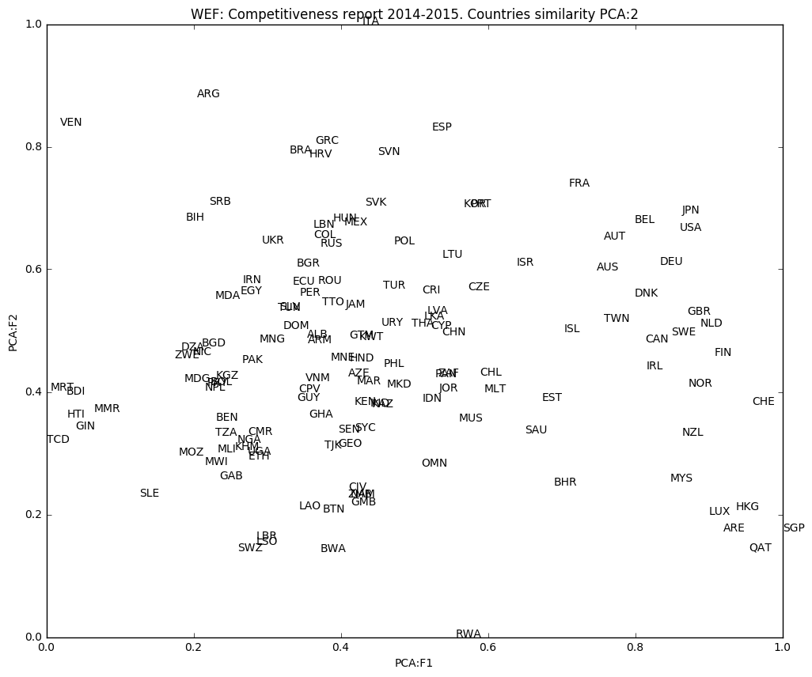

#Countries' similarity visualization using Principal Component Analysis (PCA). 
###Data from WEF Competitiveness Report 2014-2015

```python
import pandas as pd
import numpy as np
import matplotlib.pyplot as plt
from sklearn.decomposition import PCA
```


```python
dfx = pd.read_csv('wef_2014_2015.csv',sep=",",header=None)
```

In this step we filter the rows in order to have columns with the pattern 1.01 in order to set them as column headers


```python
valid=["Value"]
validCols=dfx[dfx.isin(valid)].dropna(how='all',axis=1).columns.values.tolist()
dfy=dfx.loc[:,validCols]
pattern=r'[0-9].[0-9]'
validCols=dfy[pd.DataFrame((dfy.loc[1,:]).str.contains(pattern)).transpose()].dropna(how='all',axis=1).columns.values.tolist()
basicCols=[0,1]
basicCols.extend(validCols)
df=dfx[basicCols].drop(dfy.index[[0,2]]).rename(columns=dfx.iloc[1].map(str.strip)).drop(dfy.index[1]).reset_index().drop('index',1)
df.head(5)
```


<div>
<table border="1" class="dataframe">
  <thead>
    <tr style="text-align: right;">
      <th></th>
      <th>Country</th>
      <th>Name</th>
      <th>1.01 Property rights, 1-7 (best)</th>
      <th>1.02 Intellectual property protection, 1-7 (best)</th>
      <th>1.03 Diversion of public funds, 1-7 (best)</th>
      <th>1.04 Public trust in politicians, 1-7 (best)</th>
      <th>1.05 Irregular payments and bribes, 1-7 (best)</th>
      <th>1.06 Judicial independence, 1-7 (best)</th>
      <th>1.07 Favoritism in decisions of government officials, 1-7 (best)</th>
      <th>1.08 Wastefulness of government spending, 1-7 (best)</th>
      <th>...</th>
      <th>11.06 Control of international distribution, 1-7 (best)</th>
      <th>11.08 Extent of marketing, 1-7 (best)</th>
      <th>11.05 Value chain breadth, 1-7 (best)</th>
      <th>12.01 Capacity for innovation, 1-7 (best)</th>
      <th>12.02 Quality of scientific research institutions, 1-7 (best)</th>
      <th>12.03 Company spending on R&amp;D, 1-7 (best)</th>
      <th>12.04 University-industry collaboration in R&amp;D, 1-7 (best)</th>
      <th>12.05 Gov’t procurement of advanced tech products, 1-7 (best)</th>
      <th>12.06 Availability of scientists and engineers, 1-7 (best)</th>
      <th>12.07 PCT patents, applications/million pop.*</th>
    </tr>
  </thead>
  <tbody>
    <tr>
      <th>0</th>
      <td>ALB</td>
      <td>Albania</td>
      <td>3.0483970675</td>
      <td>3.2145004894</td>
      <td>3.2197790429</td>
      <td>2.5615939877</td>
      <td>3.7359721026</td>
      <td>2.6354204428</td>
      <td>3.3630807486</td>
      <td>3.2821955775</td>
      <td>...</td>
      <td>3.3817044166</td>
      <td>4.0860253711</td>
      <td>2.8289337475</td>
      <td>3.5797459524</td>
      <td>2.2811480384</td>
      <td>2.8535667253</td>
      <td>2.3393567634</td>
      <td>3.829768256</td>
      <td>3.2388779869</td>
      <td>0.1775568182</td>
    </tr>
    <tr>
      <th>1</th>
      <td>DZA</td>
      <td>Algeria</td>
      <td>3.7481180374</td>
      <td>3.2731704392</td>
      <td>3.0158714957</td>
      <td>2.9065298248</td>
      <td>3.0992395296</td>
      <td>3.3371476026</td>
      <td>3.0747549534</td>
      <td>3.0641334298</td>
      <td>...</td>
      <td>3.3761983507</td>
      <td>3.4653590579</td>
      <td>3.2538325621</td>
      <td>3.2583286854</td>
      <td>2.9862876819</td>
      <td>2.5710069782</td>
      <td>2.2643380489</td>
      <td>3.0567202669</td>
      <td>3.9200354619</td>
      <td>0.1816115165</td>
    </tr>
    <tr>
      <th>2</th>
      <td>AGO</td>
      <td>Angola</td>
      <td>NaN</td>
      <td>NaN</td>
      <td>NaN</td>
      <td>NaN</td>
      <td>NaN</td>
      <td>NaN</td>
      <td>NaN</td>
      <td>NaN</td>
      <td>...</td>
      <td>NaN</td>
      <td>NaN</td>
      <td>NaN</td>
      <td>NaN</td>
      <td>NaN</td>
      <td>NaN</td>
      <td>NaN</td>
      <td>NaN</td>
      <td>NaN</td>
      <td>NaN</td>
    </tr>
    <tr>
      <th>3</th>
      <td>ARG</td>
      <td>Argentina</td>
      <td>2.876021471</td>
      <td>2.9878502035</td>
      <td>1.8864346814</td>
      <td>1.617514298</td>
      <td>2.8935715256</td>
      <td>2.4380000544</td>
      <td>1.7301915836</td>
      <td>1.4532491371</td>
      <td>...</td>
      <td>3.3793498945</td>
      <td>4.3921181107</td>
      <td>3.6233684635</td>
      <td>3.8884128284</td>
      <td>4.36840312</td>
      <td>2.886038537</td>
      <td>3.635343996</td>
      <td>2.5022778368</td>
      <td>3.495813942</td>
      <td>1.2910076123</td>
    </tr>
    <tr>
      <th>4</th>
      <td>ARM</td>
      <td>Armenia</td>
      <td>3.9584149935</td>
      <td>3.5153694254</td>
      <td>3.2032087582</td>
      <td>2.8249232295</td>
      <td>3.8567736114</td>
      <td>2.9612802824</td>
      <td>3.1093125571</td>
      <td>3.0133635063</td>
      <td>...</td>
      <td>3.3716402711</td>
      <td>3.5937898364</td>
      <td>3.6042720463</td>
      <td>3.7573862218</td>
      <td>3.1556111803</td>
      <td>2.8202464198</td>
      <td>3.051862476</td>
      <td>2.8478611599</td>
      <td>4.1120688078</td>
      <td>3.7336177995</td>
    </tr>
  </tbody>
</table>
<p>5 rows × 116 columns</p>
</div>


```python
df=df.set_index('Country').drop('Name',1)
df.head(5)
```


<div>
<table border="1" class="dataframe">
  <thead>
    <tr style="text-align: right;">
      <th></th>
      <th>1.01 Property rights, 1-7 (best)</th>
      <th>1.02 Intellectual property protection, 1-7 (best)</th>
      <th>1.03 Diversion of public funds, 1-7 (best)</th>
      <th>1.04 Public trust in politicians, 1-7 (best)</th>
      <th>1.05 Irregular payments and bribes, 1-7 (best)</th>
      <th>1.06 Judicial independence, 1-7 (best)</th>
      <th>1.07 Favoritism in decisions of government officials, 1-7 (best)</th>
      <th>1.08 Wastefulness of government spending, 1-7 (best)</th>
      <th>1.09 Burden of government regulation, 1-7 (best)</th>
      <th>1.10 Efficiency of legal framework in settling disputes, 1-7 (best)</th>
      <th>...</th>
      <th>11.06 Control of international distribution, 1-7 (best)</th>
      <th>11.08 Extent of marketing, 1-7 (best)</th>
      <th>11.05 Value chain breadth, 1-7 (best)</th>
      <th>12.01 Capacity for innovation, 1-7 (best)</th>
      <th>12.02 Quality of scientific research institutions, 1-7 (best)</th>
      <th>12.03 Company spending on R&amp;D, 1-7 (best)</th>
      <th>12.04 University-industry collaboration in R&amp;D, 1-7 (best)</th>
      <th>12.05 Gov’t procurement of advanced tech products, 1-7 (best)</th>
      <th>12.06 Availability of scientists and engineers, 1-7 (best)</th>
      <th>12.07 PCT patents, applications/million pop.*</th>
    </tr>
    <tr>
      <th>Country</th>
      <th></th>
      <th></th>
      <th></th>
      <th></th>
      <th></th>
      <th></th>
      <th></th>
      <th></th>
      <th></th>
      <th></th>
      <th></th>
      <th></th>
      <th></th>
      <th></th>
      <th></th>
      <th></th>
      <th></th>
      <th></th>
      <th></th>
      <th></th>
      <th></th>
    </tr>
  </thead>
  <tbody>
    <tr>
      <th>ALB</th>
      <td>3.0483970675</td>
      <td>3.2145004894</td>
      <td>3.2197790429</td>
      <td>2.5615939877</td>
      <td>3.7359721026</td>
      <td>2.6354204428</td>
      <td>3.3630807486</td>
      <td>3.2821955775</td>
      <td>4.5200337922</td>
      <td>2.8086160083</td>
      <td>...</td>
      <td>3.3817044166</td>
      <td>4.0860253711</td>
      <td>2.8289337475</td>
      <td>3.5797459524</td>
      <td>2.2811480384</td>
      <td>2.8535667253</td>
      <td>2.3393567634</td>
      <td>3.829768256</td>
      <td>3.2388779869</td>
      <td>0.1775568182</td>
    </tr>
    <tr>
      <th>DZA</th>
      <td>3.7481180374</td>
      <td>3.2731704392</td>
      <td>3.0158714957</td>
      <td>2.9065298248</td>
      <td>3.0992395296</td>
      <td>3.3371476026</td>
      <td>3.0747549534</td>
      <td>3.0641334298</td>
      <td>3.3042293998</td>
      <td>3.3782367898</td>
      <td>...</td>
      <td>3.3761983507</td>
      <td>3.4653590579</td>
      <td>3.2538325621</td>
      <td>3.2583286854</td>
      <td>2.9862876819</td>
      <td>2.5710069782</td>
      <td>2.2643380489</td>
      <td>3.0567202669</td>
      <td>3.9200354619</td>
      <td>0.1816115165</td>
    </tr>
    <tr>
      <th>AGO</th>
      <td>NaN</td>
      <td>NaN</td>
      <td>NaN</td>
      <td>NaN</td>
      <td>NaN</td>
      <td>NaN</td>
      <td>NaN</td>
      <td>NaN</td>
      <td>NaN</td>
      <td>NaN</td>
      <td>...</td>
      <td>NaN</td>
      <td>NaN</td>
      <td>NaN</td>
      <td>NaN</td>
      <td>NaN</td>
      <td>NaN</td>
      <td>NaN</td>
      <td>NaN</td>
      <td>NaN</td>
      <td>NaN</td>
    </tr>
    <tr>
      <th>ARG</th>
      <td>2.876021471</td>
      <td>2.9878502035</td>
      <td>1.8864346814</td>
      <td>1.617514298</td>
      <td>2.8935715256</td>
      <td>2.4380000544</td>
      <td>1.7301915836</td>
      <td>1.4532491371</td>
      <td>2.2087368155</td>
      <td>2.6809355831</td>
      <td>...</td>
      <td>3.3793498945</td>
      <td>4.3921181107</td>
      <td>3.6233684635</td>
      <td>3.8884128284</td>
      <td>4.36840312</td>
      <td>2.886038537</td>
      <td>3.635343996</td>
      <td>2.5022778368</td>
      <td>3.495813942</td>
      <td>1.2910076123</td>
    </tr>
    <tr>
      <th>ARM</th>
      <td>3.9584149935</td>
      <td>3.5153694254</td>
      <td>3.2032087582</td>
      <td>2.8249232295</td>
      <td>3.8567736114</td>
      <td>2.9612802824</td>
      <td>3.1093125571</td>
      <td>3.0133635063</td>
      <td>3.5333453567</td>
      <td>3.3257024446</td>
      <td>...</td>
      <td>3.3716402711</td>
      <td>3.5937898364</td>
      <td>3.6042720463</td>
      <td>3.7573862218</td>
      <td>3.1556111803</td>
      <td>2.8202464198</td>
      <td>3.051862476</td>
      <td>2.8478611599</td>
      <td>4.1120688078</td>
      <td>3.7336177995</td>
    </tr>
  </tbody>
</table>
<p>5 rows × 114 columns</p>
</div>


```python
df=df.dropna(how='all').dropna(axis=1)
df=df.convert_objects(convert_numeric=True) #convert the data that is in a string format to numeric
df=df.dropna(axis=1)
```

    /home/bsaldivar/anaconda3/envs/py35/lib/python3.5/site-packages/ipykernel/__main__.py:2: FutureWarning: convert_objects is deprecated.  Use the data-type specific converters pd.to_datetime, pd.to_timedelta and pd.to_numeric.
      from ipykernel import kernelapp as app


While normalizing the data I saw that there was a column that didn't have numbers as values


```python
dfnd=df-df.mean()
nullD=dfnd.isnull().any(axis=0).values.tolist()
for i,item in enumerate(nullD):
    if item==True:
        print("Found",i)
dfnd.iloc[:,50:51].head(5)

#dfn=((dfx-dfx.mean()).dropna(axis=1))/((dfx.std()).dropna(axis=1))
#dfn
#dfx.isnull().any(axis=1)

#dfn=(dfx.subtract(np.mean(dfx)))#/np.std(dfx)
#dfn
#dfn.isnull().any(axis=0)
```

    Found 50


    /home/bsaldivar/anaconda3/envs/py35/lib/python3.5/site-packages/pandas/core/ops.py:1179: VisibleDeprecationWarning: boolean index did not match indexed array along dimension 0; dimension is 1 but corresponding boolean dimension is 140
      yrav = yrav[mask]


<div>
<table border="1" class="dataframe">
  <thead>
    <tr style="text-align: right;">
      <th></th>
      <th>3.05 Country credit rating, 0–100 (best)*</th>
    </tr>
    <tr>
      <th>Country</th>
      <th></th>
    </tr>
  </thead>
  <tbody>
    <tr>
      <th>ALB</th>
      <td>NaN</td>
    </tr>
    <tr>
      <th>DZA</th>
      <td>NaN</td>
    </tr>
    <tr>
      <th>ARG</th>
      <td>NaN</td>
    </tr>
    <tr>
      <th>ARM</th>
      <td>NaN</td>
    </tr>
    <tr>
      <th>AUS</th>
      <td>NaN</td>
    </tr>
  </tbody>
</table>
</div>


```python
df['3.05 Country credit rating, 0–100 (best)*'].head(5)
```


    Country
    ALB    noshow
    DZA    noshow
    ARG    noshow
    ARM    noshow
    AUS    noshow
    Name: 3.05 Country credit rating, 0–100 (best)*, dtype: object


```python
df=df.drop('3.05 Country credit rating, 0–100 (best)*', axis=1)
```


```python
dfn=(df-df.mean())/df.std() #normalize the data
```


```python
pca=PCA(n_components=2) #Changing the amount of dimensions to 2.
pca.fit(dfn)
dfp2 = pca.transform(dfn)
EV=pca.explained_variance_
print("Explained variance:",np.sum(EV))
dfp2=pd.DataFrame(dfp2)
dfp2=dfp2.rename(columns={0:'F1',1:'F2'})
dfp2=dfp2.set_index(dfn.index)
```

    Explained variance: 61.9477487072


```python
dfp=(dfp2-dfp2.min())/(dfp2.max()-dfp2.min()) #normalize to a range 0:1 to see the plot properly
fig = plt.figure(figsize=(12,10))
countries=dfp2.index.values.tolist()
for i, txt in enumerate(countries):
    plt.text(dfp.iloc[i,0],dfp.iloc[i,1],txt)
plt.title("WEF: Competitiveness report 2014-2015. Countries similarity PCA:2")
plt.xlabel("PCA:F1")
plt.ylabel("PCA:F2")
plt.show()
```





